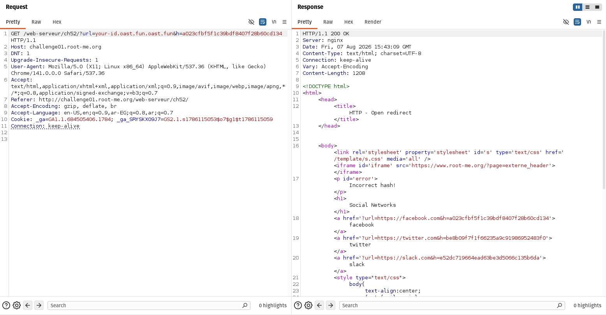

# HTTP - Open Redirect

## Description

The application accepts two parameters:

```text
url=https://facebook.com
h=a023cfbf5f1c39bdf8407f28b60cd134
```

The goal of the challenge is to redirect the application to an arbitrary domain.

---

## Initial Attempt

I first created a temporary domain using **Interactsh** to monitor any incoming requests.

Then, I replaced the original `url` parameter with my Interactsh domain.

However, the application responded with:

```text
Incorrect hash!
```



This indicated that the value of the `h` parameter was tied to the value of the `url` parameter.

---

## Analysis

By inspecting the response, I noticed that every predefined URL had its own corresponding hash.

For example:

```text
https://facebook.com
↓
a023cfbf5f1c39bdf8407f28b60cd134
```

This suggested that the application was validating the URL using a hash.

To verify this assumption, I calculated the MD5 hash of the original URL:

```bash
echo -n "https://facebook.com" | md5sum
```

The output was:

```text
a023cfbf5f1c39bdf8407f28b60cd134
```

which exactly matched the `h` value used by the application.

This confirmed that the application was validating requests using:

```text
MD5(url)
```

---

## Exploitation

Next, I generated the MD5 hash of my Interactsh domain:

```bash
echo -n "sxrpereyeooownvyozblqvr5a6463prkh.oast.fun" | md5sum
```

Then I replaced:

- `url` → my Interactsh domain
- `h` → the newly generated MD5 hash

The final request looked like:

```text
url=sxrpereyeooownvyozblqvr5a6463prkh.oast.fun
h=<MD5 of my Interactsh domain>
```

After sending the request:

- The hash validation succeeded.
- The application redirected to my Interactsh domain.
- The challenge flag was displayed.

---

## Root Cause

The application attempted to protect the redirect by validating:

```text
MD5(url)
```

Since MD5 is a public hashing algorithm and no secret key (such as HMAC) was used, anyone can calculate the correct hash for any URL.

As a result, an attacker can generate a valid hash for an arbitrary domain and bypass the intended Open Redirect protection.
