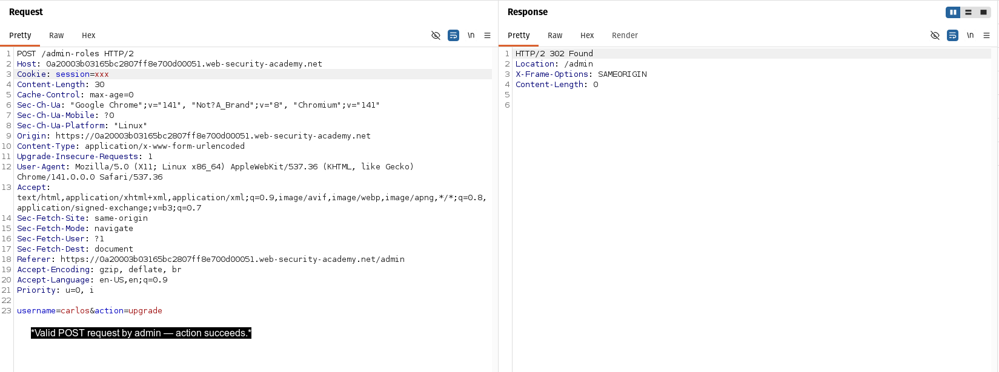
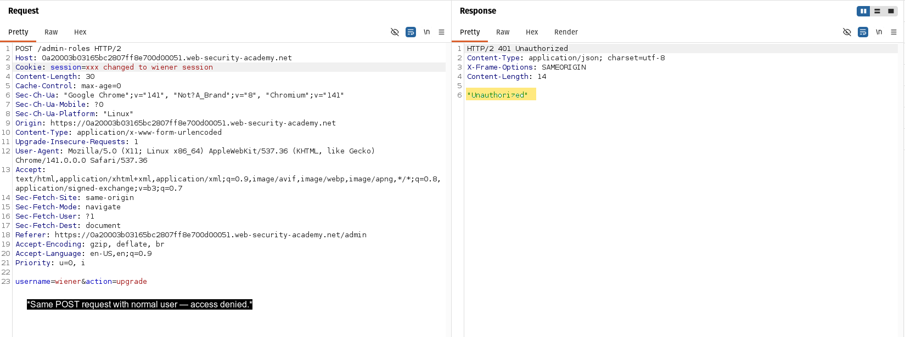
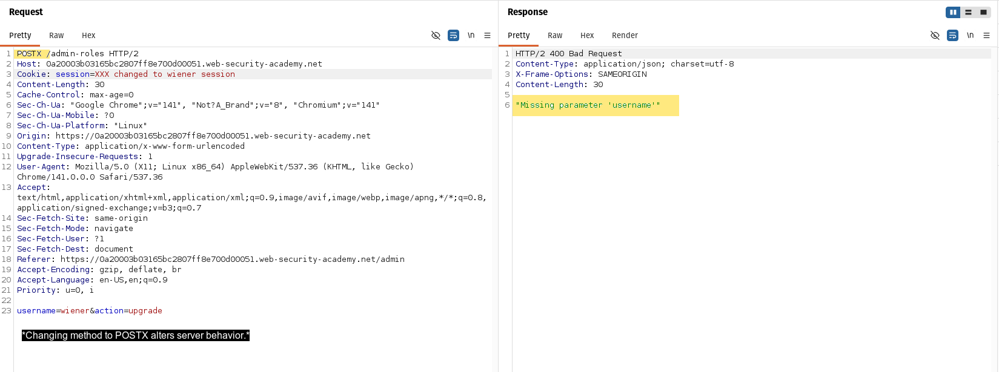
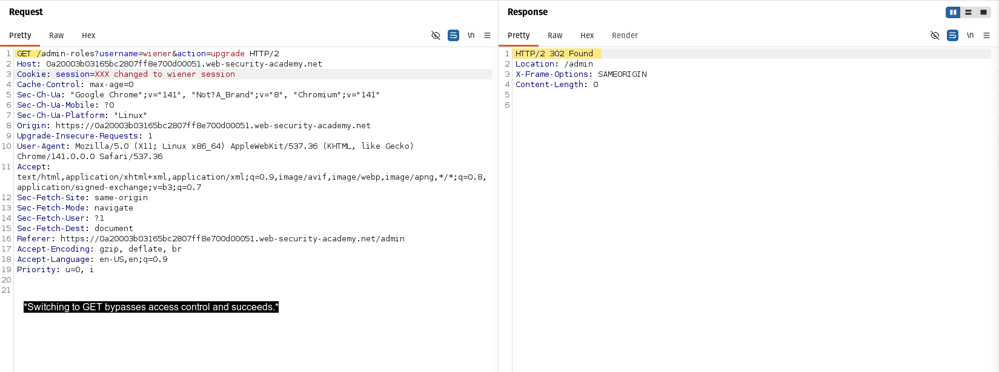
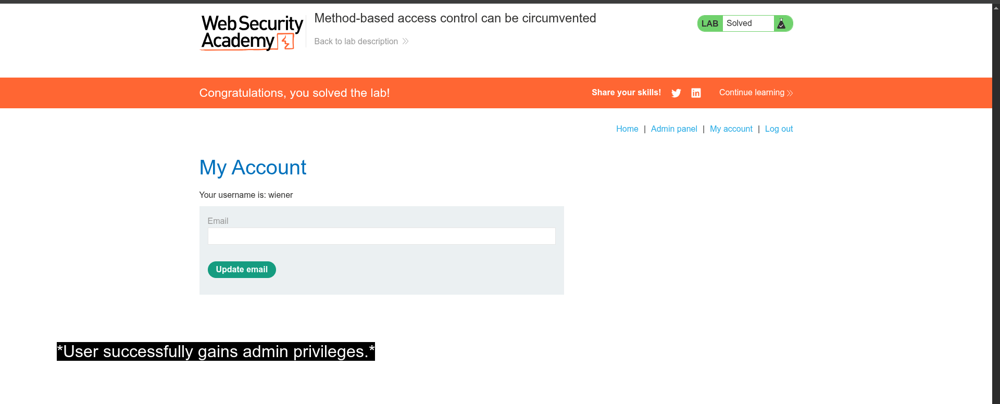

#  Method-Based Access Control Bypass

##  Summary
The application enforces access control based on the HTTP method.  
By modifying the request method, it is possible to bypass these restrictions and perform privileged actions as a non-administrative user.

---

##  Vulnerability Type
- Broken Access Control
- Method-Based Access Control Bypass

---

##  Affected Endpoint

```http
POST /admin-roles
```

---

##  Steps to Reproduce

1. Login as administrator:

**Credentials:**
```
administrator:admin
```

2. Perform a privileged action (e.g., promote a user) and intercept the request using Burp Suite.

3. Send the request to Repeater.

4. Login as a normal user:

**Credentials:**
```
wiener:peter
```

5. Replace the session cookie in the request with the normal user's session.

6. Modify the username parameter to your user:
```
username=wiener
```

7. Observe that the request returns:
```
Unauthorized
```

8. Change the HTTP method from:
```
POST → GET
```

9. Send the request again.

---

##  Evidence

### 1. Admin Request
  
*Valid POST request by admin — action succeeds.*

---

### 2. Unauthorized POST
  
*Same POST request with normal user — access denied.*

---

### 3. Invalid Method
  
*Changing method to POSTX alters behavior.*

---

### 4. Method Bypass
  
*Switching to GET bypasses access control.*

---

### 5. Admin Access Confirmation
  
*User successfully gains admin privileges.*

---

##  Proof of Concept (PoC)

A restricted POST request returns:
```
Unauthorized
```

After changing the method to GET, the same request is accepted and processed successfully.

This confirms that access control is improperly enforced based on the HTTP method.

---

##  Impact

- Privilege escalation to administrator
- Unauthorized access to restricted functionality
- Ability to perform sensitive actions (e.g., role modification)

---

##  Root Cause

- Access control is enforced based on HTTP method only
- Missing consistent authorization checks across different request methods
- Trusting request structure instead of verifying user permissions

---

##  Mitigation

- Enforce server-side authorization checks for all request methods
- Apply consistent access control regardless of HTTP method
- Validate user permissions before performing any sensitive action

---

##  Severity (CVSS Estimate)

**High (8.0 - 8.8)**  

CVSS Vector:
```
AV:N/AC:L/PR:L/UI:N/S:U/C:H/I:H/A:L
```

---

##  Key Insight

> The application relies on HTTP method-based access control, allowing attackers to bypass restrictions by modifying the request method.

---

##  References

- PortSwigger Web Security Academy
