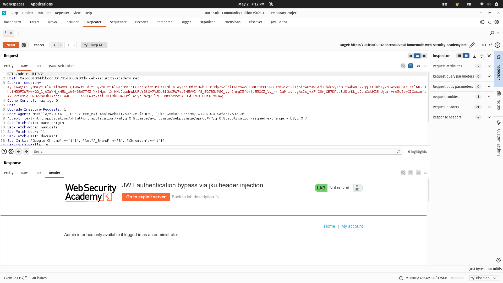
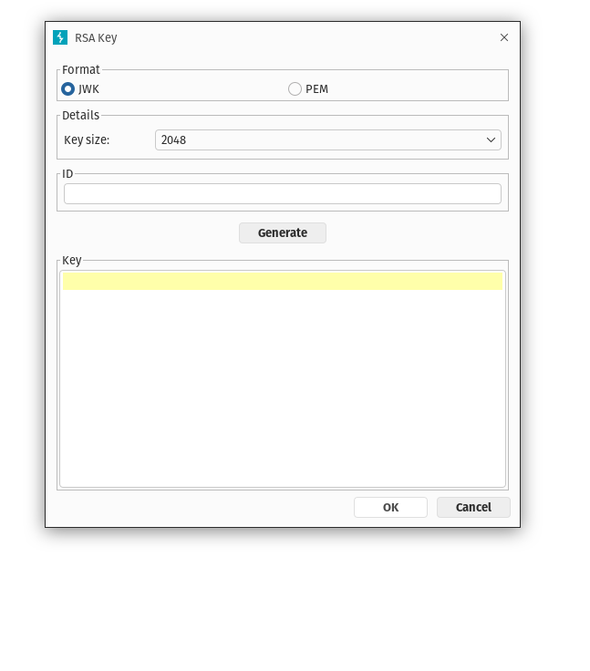
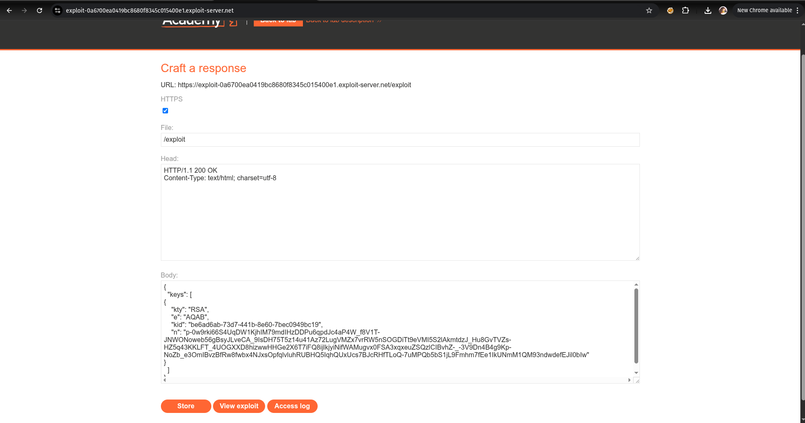
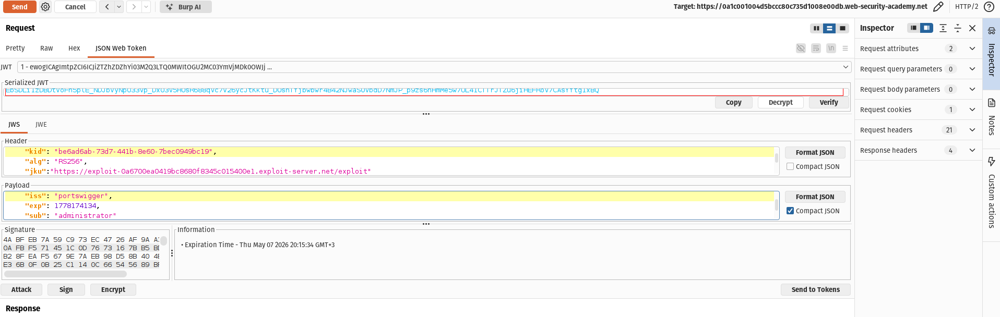
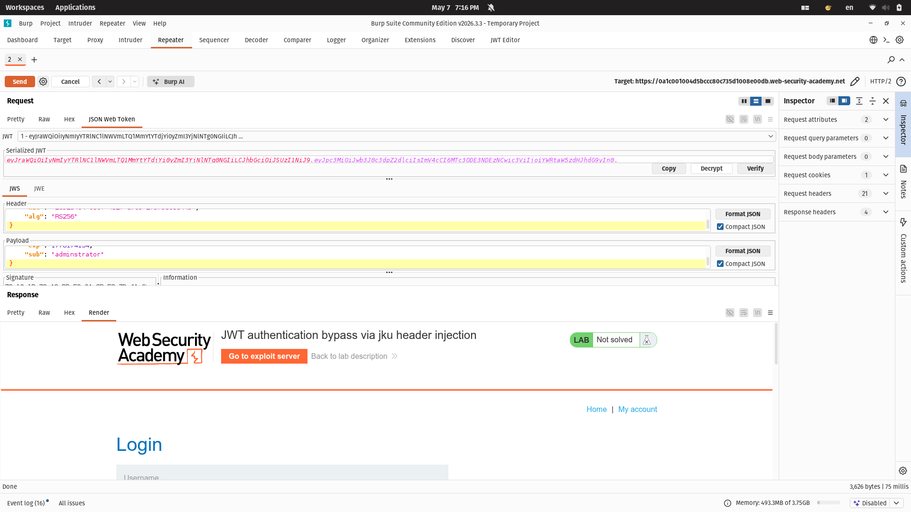
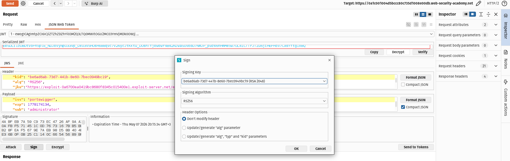
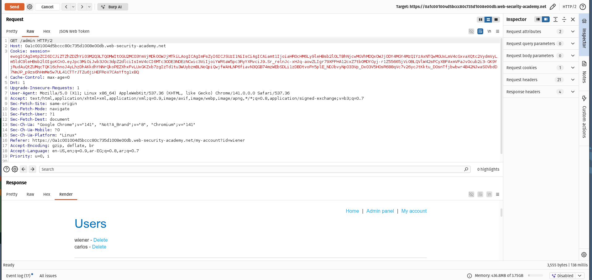
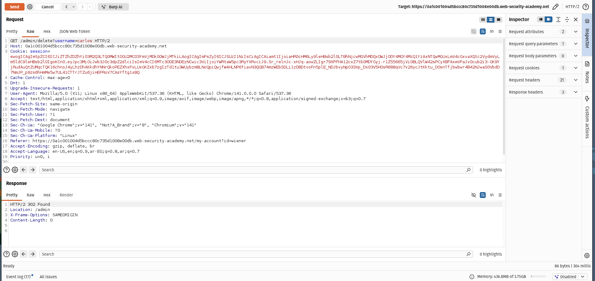

# Lab: JWT authentication bypass via jku header injection

## Description
This lab demonstrates a JWT authentication bypass vulnerability caused by insecure handling of the `jku` header parameter.  
The server accepts a user-controlled URL and fetches public keys from it without validating whether the domain is trusted.

By abusing this behavior, it is possible to host a malicious JWK Set, sign a forged JWT using a matching private key, and gain administrator access.

---

# Vulnerability Type
- JWT Header Injection
- Broken Authentication
- Broken Access Control

## Related OWASP Categories
- OWASP A01: Broken Access Control
- OWASP A07: Identification and Authentication Failures

---

# Objective
- Forge a valid JWT
- Access `/admin`
- Delete the user `carlos`

---

# Step 1 — Access Control Check

After logging in using the provided credentials:

```txt
wiener:peter
```

I intercepted the authenticated request and changed the path from:

```http
/my-account
```

to:

```http
/admin
```

The server denied access because the JWT belonged to a normal user.

Image:

```md

```

---

# Step 2 — Generate an RSA Key Pair

Using the JWT Editor extension in Burp Suite:

```txt
JWT Editor → Keys → New RSA Key → Generate
```

I generated a new RSA public/private key pair.

Image:

```md

```

---

# Step 3 — Export the Public Key as JWK

The generated public key was copied in JWK format using:

```txt
Copy Public Key as JWK
```

Image:

```md

```

---

# Step 4 — Upload a Malicious JWK Set

Inside the exploit server, I created a malicious JWK Set containing my public key:

```json
{
  "keys": [
    {
      "kty": "RSA",
      "e": "AQAB",
      "kid": "example-kid",
      "n": "example-modulus"
    }
  ]
}
```

This allowed the vulnerable server to fetch attacker-controlled verification keys.

Image:

```md

```

---

# Step 5 — Modify the JWT Header

The JWT header was modified to:
- Replace the `kid` value with my uploaded key ID
- Add a malicious `jku` parameter pointing to my exploit server

Example:

```json
{
  "kid": "be6ad6ab-73d7-441b-8e60-7bec0949bc19",
  "alg": "RS256",
  "jku": "https://exploit-server-url/exploit"
}
```

Image:

```md

```

---

# Step 6 — Modify the JWT Payload

The `sub` claim was changed from:

```json
"sub":"wiener"
```

to:

```json
"sub":"administrator"
```

Image:

```md

```

---

# Step 7 — Sign the Forged JWT

The modified token was signed using the generated RSA private key.

Because the server trusted the attacker-controlled `jku` URL, it fetched my public key and successfully verified the malicious JWT signature.

Image:

```md

```

---

# Step 8 — Access the Admin Panel

After sending the forged JWT, administrator access was granted successfully.

Image:

```md

```

---

# Step 9 — Delete Carlos User

Finally, the following endpoint was used to delete the target user:

```http
/admin/delete?username=carlos
```

Image:

```md

```

---

# Root Cause

The application trusted arbitrary external URLs provided in the `jku` header without validating:
- trusted domains
- allowed key sources
- key ownership

This allowed attackers to supply their own verification keys and forge valid JWTs.

---

# Impact

Successful exploitation may allow attackers to:
- Forge valid JWTs
- Impersonate arbitrary users
- Escalate privileges
- Bypass authentication and authorization mechanisms
- Gain full administrative access

---

# Remediation

- Never trust user-controlled `jku` values
- Use a strict allowlist of trusted domains
- Ignore external key references whenever possible
- Validate JWT signatures using server-side trusted keys only
- Implement proper key management policies

---

# Tools Used

- Burp Suite
- JWT Editor Extension
- Exploit Server

---

# Key Takeaway

JWT security does not depend only on cryptography itself, but also on securely handling key selection and verification logic.
