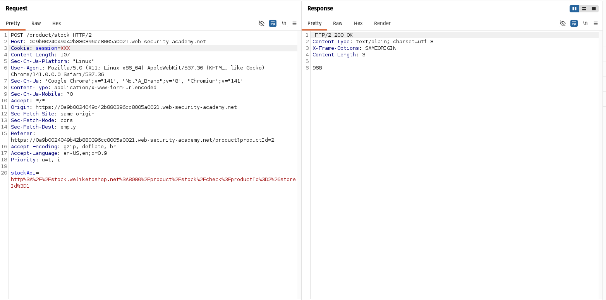
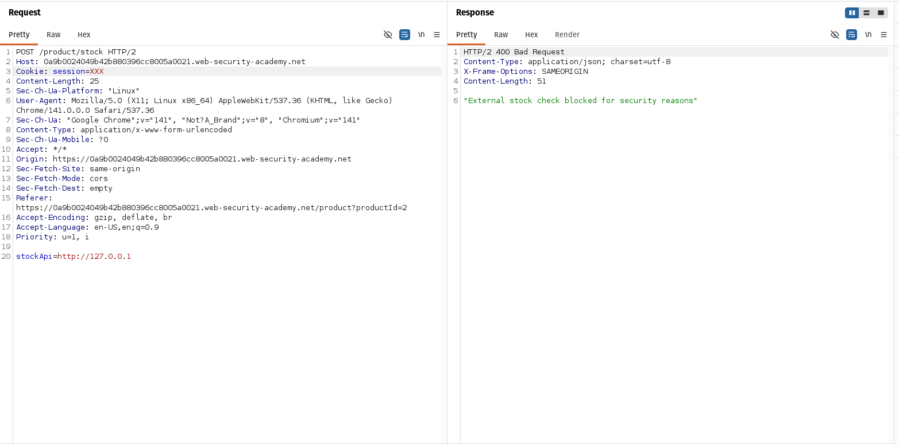
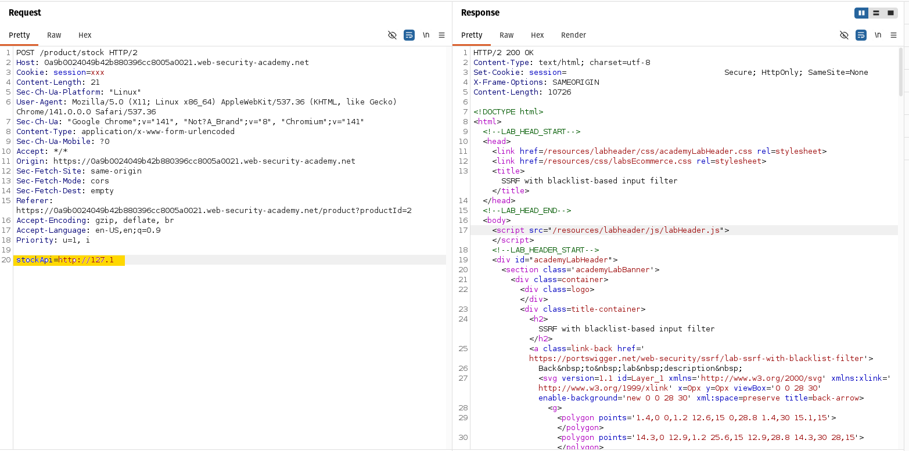
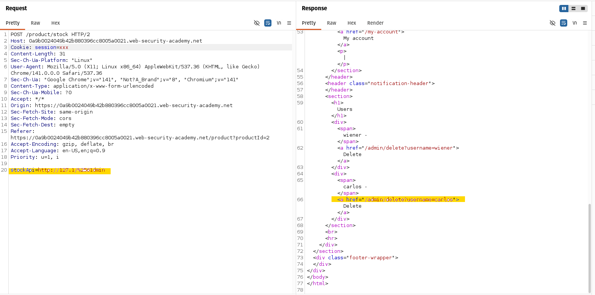
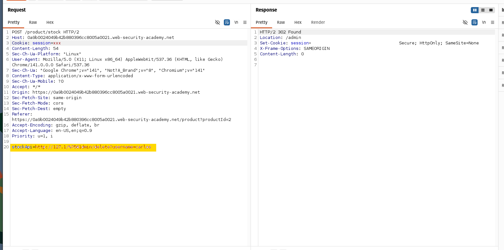

# 🔓 SSRF with Blacklist-Based Input Filter

## 📌 Summary
While testing the stock check functionality, I noticed that the application makes server-side requests based on user input.  
This behavior led me to test for SSRF vulnerabilities.

The application attempts to block access to internal resources using a blacklist, but I was able to bypass these protections and access the admin panel.

---

## 🧪 My Testing Approach

When I clicked "Check stock", I intercepted the request in Burp Suite and found the following parameter:

```http
stockApi=http://stock.weliketoshop.net:8080/product/stock/check?productId=1
```

This indicated that the server is fetching the URL itself, which is a typical SSRF entry point.

*Original request before exploitation.*


### 🔹 Step 1 — Testing localhost access

I first tried changing the URL to:

```
http://127.0.0.1
```

The request was blocked.

  
*Request to localhost is blocked.*

---

### 🔹 Step 2 — Bypassing IP filter

Since `127.0.0.1` was blocked, I tested alternative representations of localhost:

```
http://127.1
```

This time, the request was accepted.

  
*Using an alternative IP representation bypasses the filter.*

---

### 🔹 Step 3 — Accessing admin panel

Next, I attempted to access the admin panel:

```
http://127.1/admin
```

The request was blocked again.

  
*Direct access to /admin is blocked.*

---

### 🔹 Step 4 — Bypassing path filter

Since `/admin` was filtered, I tried encoding techniques.

I used double URL encoding for the letter "a":

```
http://127.1/%2561dmin
```

This successfully bypassed the filter and gave access to the admin panel.

  
*Double encoding bypass allows access to admin functionality.*

---

### 🔹 Step 5 — Exploitation

From the admin panel, I was able to delete the user `carlos`, successfully solving the lab.
---
  
*Admin action performed via SSRF.*

---

## 📌 Vulnerability Type
- Server-Side Request Forgery (SSRF)
- Blacklist Bypass

---

## 📌 Proof of Concept (PoC)

By modifying the `stockApi` parameter to:

```
http://127.1/%2561dmin
```

The server processes the request and returns the internal admin panel, confirming SSRF exploitation.

---

## 🚨 Impact

- Access to internal services not exposed externally
- Unauthorized access to admin functionality
- Ability to perform privileged actions (e.g., delete users)

---

## ⚠️ Root Cause

- Reliance on blacklist-based filtering instead of proper validation
- Failure to normalize and validate input before processing
- Allowing user-controlled URLs to be fetched by the server

---

## 🛠️ Mitigation

- Use a strict allowlist of permitted domains
- Block all internal IP ranges (127.0.0.0/8, localhost, etc.)
- Normalize and validate URLs before processing

---

## 🧠 Key Insight

> Blacklist-based defenses are unreliable. Attackers can bypass them using alternative IP formats and encoding techniques.
